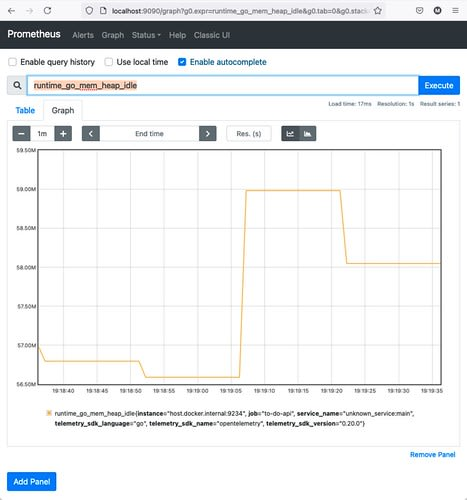
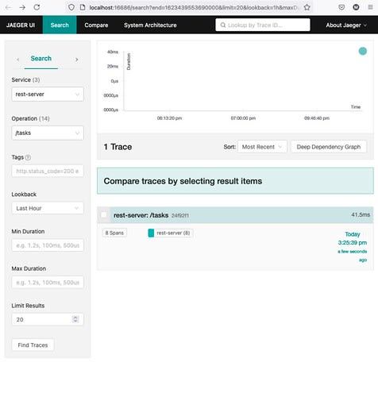
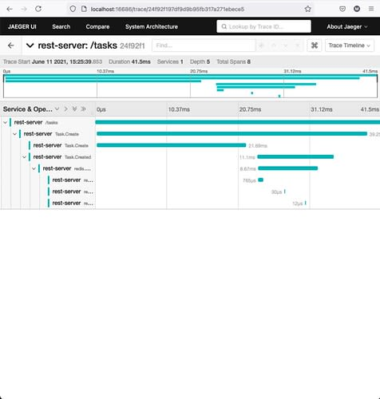

# OpenTelemetry

什么是 OpenTelemetry？

> OpenTelemetry 是一系列的 APIs，SDKs，工具和集成，设计用于创建和管理*traces*、*metrics*和*日志*等遥测数据。该项目提供了一个与供应商无关的实现，可以将其配置为将遥测数据发送到后端。

某种程度上，OpenTelemetry 是*可观测性* observability 的间接结果，因为需要监控用不同技术编写的多个服务，这使得收集和聚合可观测性数据变得更加困难。

`OpenTelemetry` 不提供具体的可观测性后端，而是一个*标准*方式用于配置，发散，收集，处理，以及导出数据；对于这些后端，有一些商业支持的选项，如 NewRelic 和 Lightstep，以及一些开源项目，在这篇文章中我将具体介绍:

- `Prometheus` 用于收集 metrics
- `Jaeger` 用于收集 traces

OpenTelemetry 支持 Go 的日志，而数据暂未支持，然而我还是会展示如何使用 Uber's zap 来处理日志数据。

## 在 Go 中 使用 OpenTelemetry

目前，以下是 OpenTelemetry 对 Go 的支持情况:

- **Tracing** Beta
- **Metrics** Alpha
- **Logging** 暂未实现

[官方文档](https://opentelemetry.io/docs/instrumentation/go/)中描述了在 Go 程序中添加 OpenTelemetry 支持所需的步骤，尽管实现还没有达到主要的官方版本，但我们仍然可以在生产中使用它。还有一个注册表，列出了实现检测或跟踪的不同 Go 包。

### Metrics

收集 metrics 为 **Prometheus** 所用。根据官方文档，导出器应该如下定义：

```go
promExporter, _ := prometheus.NewExportPipeline(prometheus.Config{}) // XXX: error omitted for brevity
global.SetMeterProvider(promExporter.MeterProvider())
```

该 exporter 实现了 `http.Handler`，因此我们可以使其成为一个 HTTP 服务上的一个路由，这样 Prometheus 就可以收集到 metric 数据了：

```go
r := mux.NewRouter()
r.Handle("/metrics", promExporter)
```

有一点很重要的是 Prometheus 从我们的服务拉取数据，我们需要指定地址与端口，我们使用的是 docker 所以配置文件需要包括以下：

```yaml
scrape_configs:
  - job_name: to-do-api
    scrape_interval: 5s
    static_configs:
      - targets: ["host.docker.internal:9234"]
```

访问 `http://localhost:9090/` 将会展示一个用户界面，在输入一个 metric 并选择后就会如下所示：



### Tracing

Jaeger 用于收集 metrics。相比于 Metrics，定义该 exporter 需要更详尽的描述：

```yaml
jaegerEndpoint, _ := conf.Get("JAEGER_ENDPOINT")

jaegerExporter, _ := jaeger.NewRawExporter(
jaeger.WithCollectorEndpoint(jaegerEndpoint),
jaeger.WithSDKOptions(sdktrace.WithSampler(sdktrace.AlwaysSample())),
jaeger.WithProcessFromEnv(),
)

tp := sdktrace.NewTracerProvider(
sdktrace.WithSampler(sdktrace.AlwaysSample()),
sdktrace.WithSyncer(jaegerExporter),
)

otel.SetTracerProvider(tp)
otel.SetTextMapPropagator(propagation.NewCompositeTextMapPropagator(propagation.TraceContext{}, propagation.Baggage{}))
```

上述定义是拥有一个完整的 tracing 支持的第一步，接着我们需要定义 Spans，它可以是手动或者自动的，这取决于我们打算使用的 tracing wrapper；本案例中使用手动的。

例如在 `postgresql` 包中，每个方法的类型定义如下：

```go
ctx, span := trace.SpanFromContext(ctx).Tracer().Start(ctx, "<name>")
 // If needed: N calls to "span.SetAttributes(...)"
defer span.End()
```

例如在 `postgres.Task.Create` 中：

```go
ctx, span := trace.SpanFromContext(ctx).Tracer().Start(ctx, "Task.Create")
span.SetAttributes(attribute.String("db.system", "postgresql"))
defer span.End()
```

`OpenTelemetry` `specification` 定义了一些关于属性名称以及支持值的惯例，因此上述例子中使用的属性 `db.system` 即是 `Database conventions` 的一部分；在一些别的包中 `go.opentelemetry.io/otel/semcony` 定义了我们可以使用的常量，因此我们需要时刻的关注它。

同样的 `service.Task.Create` 方法：

```go
ctx, span := trace.SpanFromContext(ctx).Tracer().Start(ctx, "Task.Create")
defer span.End()
```

我们可以记录每一层的调用用于测量其所花费的时间以及任意可能会发生的错误。访问 `http://localhost:16686/search` 将会展示一个如下的用户界面：



点击 "Find Traces" 我们可以看到类似如下：



每个 _Span_ 是一层用于描述调用的交互信息。`OpenTelemetry` 与 _Span_ 有意思的地方是如果它们的交互包含了其它的 OpenTelemetry 可行调用，我们可以 _联合_ join 它们，从而检查它们的整个交互信息。

## Logs

尽管 `OpenTelemetry` 暂时还未对 Go 支持 logs，然而在构建微服务时，特定的日志信息是需要被考虑到的；关于这点我推荐定义一个 logger 实例，当需要时就作为参数来传递它，这里使用的是 `uber-go/zap` 这个库。

代码中实现了一个中间件用于记录所有请求的日志：

```go
logger, _ := zap.NewProduction()
defer logger.Sync()

middleware := func(h http.Handler) http.Handler {
    return http.HandlerFunc(func(w http.ResponseWriter, r *http.Request) {
        logger.Info(r.Method,
            zap.Time("time", time.Now()),
            zap.String("url", r.URL.String()),
        )

        h.ServeHTTP(w, r)
    })
}
```

接着包裹 muxer 中的所有路由：

```go
srv := &http.Server{
    Handler: middleware(r),
    // ... other fields ...
}
```

## 总结

Go 的 `OpenTelemetry` 还是一项正在进行的工作，它当然是一个好的主意，但是频繁细小的迭代都会使得我们的代码难以跟进，意为这很可能会不时地打破 API。对于会长期运行的项目，我还是建议等待主要的版本更新后再开始使用，否则寻找一个非 OpenTelemetry 的方案会更有效率。
